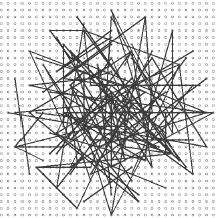
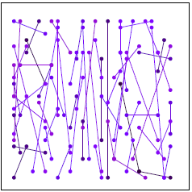
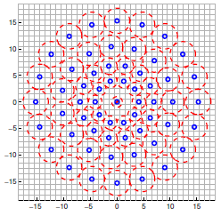

# Feature Point
{: .no_toc }

## Table of contents
{: .no_toc .text-delta }

1. TOC
{:toc}

---

# Introduction
* 시점이 변하는 여러 사진에서 같은 곳을 나타내는 포인트들을 찾는 것을 대응점 찾기라고 함
  * 파노라마 사진 제작이나 3D reconstruction 등에서 대응점 찾기는 필수적임
* 이미지들 사이에 대응점을 찾기 위한 방법으로 이미지에서 구별이 용이한 특징점들을 찾아내고(Feature Detection) 해당 특징점의 특징을 기술하여(Feature Description) 대응점을 찾아내는(Feature Matching) 방법들을 사용함
  * 

* 
  * E, F가 구별이 용이함

* 좋은 특징점 알고리즘의 조건

|    조건  | 설명  |
|:--------|:-------|
| 반복성    |  같은 물체에서 검출된 특징은 다른 사진에서도 비슷한 위치에 비슷한 속성으로 나와야 함 |
| 분별력    | 물체의 다른 곳과 충분히 구분될 수 있는 속성을 지녀야 함 |
| 지역성   | 그 주변의 작은 영역들만 보고 검출되어야 함  |
| 정확성  | 검출된 화소 위치는 정확해야 하며 상황에 따라 subpixel 레벨도 필요함 |
| 적당한 양 | 실제 적용 시 노이즈 등으로 인한 오차가 많기 때문에 적당한 양의 특징점들이 확보되어야 robustness를 확보할 수 있음 |
| 계산 효율성 | 전체과정을 빠른시간 안에 마칠 수 있어야 하며 실시간 응용에서 특히 중요 |

---

# Preliminaries
## 기초 연산들
- [Gradient](https://en.wikipedia.org/wiki/Gradient)
  - [직관적으로 설명되어 있는 페이지](https://angeloyeo.github.io/2019/08/25/gradient.html)
- [Divergence](https://en.wikipedia.org/wiki/Divergence)
  - [직관적으로 설명되어 있는 페이지](https://angeloyeo.github.io/2019/08/25/divergence.html)
- [Laplace operator](https://en.wikipedia.org/wiki/Laplace_operator)
  - $\nabla^2 f = \nabla \cdot \nabla f = div (\nabla(f))$
  - 
  - [직관적으로 설명되어 있는 페이지](https://angeloyeo.github.io/2019/08/28/laplacian.html)

---

# Feature Detection
  
* 특징점의 후보로 corner 점들을 들 수 있으며 이를 검출하기 위한 [Harris corner detector](https://docs.opencv.org/4.1.1/dc/d0d/tutorial_py_features_harris.html)와 이를 개선한 [Shi-Tomasi corner detector](https://docs.opencv.org/4.1.1/d4/d8c/tutorial_py_shi_tomasi.html) 등이 있음
  * 회전과 이동 변환에 불변이나 scale 변환에 약함
* David Lowe 가 스케일 변환에 불변인 SIFT 알고리즘을 만들었으며 이의 속도 향상 버전인 SURF도 나옴
  * SIFT는 기술 돌파로 평가되고 있으며 현재에도 좋은 성능을 나타내고 있음 (2019년 9월 인용 횟수 52,569회로 컴퓨터 비전 분야 1위임)
  * SURF는 SIFT 대비 3배 정도의 속도 향상이 있다고 함 
  * SIFT, SURF 모두 특허가 있어 사용 시 주의해야 함
  * SIFT, SURF 모두 descriptor도 제공함
* 실시간성이 중요해지면서 속도가 빠른 FAST 등장
  * FAST는 검출 알고리즘만 제시하며 주로 binary descriptor 들과 함께 쓰임
  * 스케일 변환에는 약함
* OpenCV를 관리하던 연구소에서 ORB를 만듦
  * FAST를 피라미드화한 영상에 적용하여 스케일 변환에 대비
  * 방향을 가진 BRIEF 기술자를 사용하여 회전 변환에 불변
  * SIFT, SURF를 대체하기 좋음 

## [SIFT (Scale-Invariant Feature Transform)](https://en.wikipedia.org/wiki/Scale-invariant_feature_transform)
* 소개
  * 브리티시컬럼비아 대학교의 David Lowe 교수가 2004년에 발표한 스케일 불변 특징점을 검출하는 알고리즘과 기술자 계산 방법
  * 영상의 이동, 회전, 크기 변환뿐만 아니라 **촬영 시점 변화**에도 robust함
*   
* 스케일 불변
  * 이미지의 확대/축소에 대해서도 같은 특징점을 검출하는 것을 의미
  * 단순한 코너 검출 만으로는 잘되지 않음
    * 
  * 스케일 space를 구축하고 LoG(Laplacian of Gaussian) 등을 적용 후 극값을 찾는 방법으로 극복

### 1. Scale-space Extrema Detection
- Gaussian blurring으로 축소 효과를 준 이미지들(octave)과 사이즈를 축소시킨 이미지들에 대한 옥타브들로 scale space 구성 
- 
- 정규화된 [LoG(Laplacian of Gaussian)](https://en.wikipedia.org/wiki/Blob_detection#The_Laplacian_of_Gaussian) 대신 [DoG(Difference of Gaussian)](https://en.wikipedia.org/wiki/Difference_of_Gaussians)을 사용
  - $G(x,y,k\sigma) - G(x,y,\sigma) \approx (k-1) \sigma^2 \nabla^2 G$ 인 관계가 있음
  - scale space 구성 시 Gaussian을 적용한 이미지가 있으므로 LoG 필터 적용 대신 뺄셈으로 간단히 계산 가능
- 
- 3차원의 scale space에서 DoG 이미지들을 구한 다음 주변 26개의 voxel 값과 비교하여 극값인 점들을 잠재적인 keypoint로 검출

### 2. Keypoint Localization
- 위에서 검출한 잠재적인 키포인트들을 정제 과정을 거쳐 키포인트들을 추출  
  - 키포인트 위치를 실수 단위로 Taylor series expantion을 사용해 미세조정하고 해당 위치의 이미지 값이 임계 값을 넘지 않으면 누락시킴
  - Harris corner detector에서 사용하는 Hessian matrix를 사용한 edge, corner 구분 법을 사용해 edge인 경우 누락시킴      

### 3. Orientation Assignment
- 회전에 대한 불변성을 주기 위해 키포인트마다 방향을 계산함
- Gradient의 히스토그램을 이용함

### 4. Keypoint Descriptor
- 방향을 고려한 $16 \times 16$ 샘플 array를 $4 \times 4$ 개의 블록으로 나눈 후 그 안의 gradient들을 8 방향으로 양자화하여 히스토그램으로 만듦
  - $4 \times 4 \times 8 = 128$ 차원의 벡터가 나옴
- 
  - 실제 이 그림을 4개 붙인 것으로 생각하면 됨
- 위에서 계산한 128 차원 특징 벡터를 정규화 절차를 거치게 해 광도 변환에도 불변하게 만듦

## [SURF (Speeded-Up Robust Features)](https://en.wikipedia.org/wiki/Speeded_up_robust_features)
- SIFT의 DoG 대신 Box Filter의 사용으로 LoG를 근사하여 속도를 향상시킴
- 가우시안 스무딩 대신 박스 필터 크기 조절로 옥타브를 구성
- SIFT처럼 scale space에서 필터 된 결과에 주변 26개의 voxel 값으로부터 극점을 추출
- SIFT 대비 약 3배 정도의 속도 향상
- 블러나 회전된 이미지에 대해서는 동일한 특징점을 잘 잡지만 뷰포인트 변화나 조명 변화가 있을 때 동일한 특징점이 잘 안 나옴
- 64 / 128 차원의 두 가지 기술자 제공

## [FAST (Features from Accelerated Segment Test)](https://en.wikipedia.org/wiki/Features_from_accelerated_segment_test)
- 해당 픽셀 주변의 16개 픽셀의 밝기와의 비교로 코너 검출
  - 해당 픽셀보다 충분히 밝거나 어두운 픽셀들이 연속으로 n 개 존재하면 코너로 간주 (논문에서는 $n = 12$)
  - 
  - 1, 9, 5, 13 점들을 우선 테스트하여 코너가 아닌 경우를 먼저 걸러내는 고속 테스트로 성능 향상
    - 고속 테스트의 참고 픽셀 조회가 코너 모양이나 질의 순서에 따라 효율적이지 않을 수 있어, 의사결정 트리를 활용한 머신러닝으로 효율적인 질의를 하도록 함  
- 중복되는 코너가 많이 검출되어 Non-maximal Suppression을 수행하여 제거하는 것이 좋음
  - 
- Harris corner detector 대비 20배 이상 빠름
  - 속도가 중요한 컴퓨터 비전 응용프로그램에 적합

## [ORB (Oriented FAST and Rotated BRIEF)](http://www.willowgarage.com/sites/default/files/orb_final.pdf)
- OpenCV를 관리하던 연구소에서 SIFT, SURF를 대체할 목적으로 만듦
  - SIFT, SURF는 **특허**가 있음
- 특징점 검출에 FAST를 사용
  - FAST로 찾은 후 Harris corner detector를 활용해 top N 개의 특징점을 검출
  - 이미지 피라미드를 사용하여 스케일 불변을 달성
  - 회전 불변을 위한 orientation 계산을 수행
- 특징점 기술자로 BRIEF를 사용
  - BRIEF 자체는 회전에 불변이지 않아서 이를 변형한 rBRIEF를 사용함

---

# Feature Description
- Feature descriptor의 조건
  - 분별력이 좋아야 함
    - 다른 특징을 가진 점들을 잘 구분할 수 있어야 함
  - 다양한 변환에 불변이어야 함
    - 이동, 회전, 스케일, 시점 변환 등의 다양한 변환들에 불변이어야 기술자로부터 대응점을 찾을 수 있음
    - 어떠한 변환에 불변이어야 하는지는 사용 목적에 따라 달라질 수 있음
  - 낮은 차원의 특징 벡터 
    - 비슷한 성능이라면 낮은 차원의 특징 벡터가 계산에 유리

## Binary Descriptors
- 개요
  - SIFT의 특징 벡터는 128차원이고 float형으로 하면 512바이트의 크기여서 특징점이 많으면 용량도 커지고 거리 계산에 부담이 됨
  - 이진 벡터를 사용할 경우 Hamming 거리로 계산을 XOR 연산 후 비트 카운트로 할 수 있어 성능상 이점이 큼
- 계산 방법
  - 이진 기술자들은 특징점 주변에 있는 두개의 화소들의 명암 값을 비교하여 0 또는 1의 이진벡터를 만듦
  - 비교쌍 샘플링 패턴의 차이로 불변하는 변환들에 차이가 생김
- 종류  
  - [BRIEF (Binary Robust Independent Elementary Features)](https://www.cs.ubc.ca/~lowe/525/papers/calonder_eccv10.pdf)
    - 
  - [ORB (Oriented FAST and Rotated BRIEF)](http://www.willowgarage.com/sites/default/files/orb_final.pdf)
    - 
  - [BRISK (Binary Robust Invariant Scalable Keypoints)](http://www.margaritachli.com/papers/ICCV2011paper.pdf)
    - 
- 비교

|              | BRIEF  | ORB     | BRISK |
|:-------------|:-------|:---------|:------|
| 스케일 불변    |  X     | X        | O     |
|회전 불변         | X       | O       |  O    |
| 특징 벡터 bit 수  | 256bit  | 512bit | 512bit |

---
# Feature Matching
- 특징 기술자의 특징벡터들은 거리공간 상에 있으며 거리를 측정할 수 있음
- 거리가 가장 가까운 특징점들끼리 짝을 지어주는 것이 매칭임

## Bruteforce Matching
- 한 이미지의 특징점들을 순회하면서 다른 이미지의 모든 특징점과 거리를 측정하여 가장 가까운 것을 선택하는 방법
- 반대 방향으로도 가장 가까운지 체크하여 그러하면 matching 시키는 방법을 cross checking 이라 함
- 가장 정확하지만 느림
- 

## FLANN based Matching
- [FLANN(Fast Library for Approximate Nearest Neighbors)](https://ieeexplore.ieee.org/document/8085676)은 대량의 데이터셋과 고차원의 특징들에서 빠르게 최근접 이웃을 찾기위한 알고리즘들을 모아놓은 라이브러리임
- 빠르지만 부정확할 수 있음
- 

---
# Applications

- [Structure from Motion](https://en.wikipedia.org/wiki/Structure_from_motion)
  -   

- Markerless AR
  - 
  - 
  - 
  
- Visual [SLAM](https://en.wikipedia.org/wiki/Simultaneous_localization_and_mapping)
  - 
  - 

---
# References
* [OpenCV docs](https://docs.opencv.org)
* [Basics of AR: Anchors, Keypoints & Feature Detection](https://www.andreasjakl.com/basics-of-ar-anchors-keypoints-feature-detection/)
* [Basics of AR: SLAM – Simultaneous Localization and Mapping](https://www.andreasjakl.com/basics-of-ar-slam-simultaneous-localization-and-mapping/)
