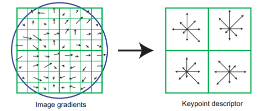

# Feature Point
{: .no_toc }

## Table of contents
{: .no_toc .text-delta }

1. TOC
{:toc}

---

# Introduction
* 이미지들 사이에 대응점을 찾기 위한 방법으로 이미지에서 구별이 용이한 특징점들을 찾아내고(Feature Detection) 해당 특징점의 특징을 기술하여(Feature Description) 대응점을 찾아내는(Feature Matching) 방법들을 사용함
  * 

* 
  * E, F가 구별이 용이함

---

# Feature Detection
* 특징점의 후보로 corner 점들을 들 수 있으며 이를 검출하기 위한 Harris corner detector와 이를 개선한 Shi-Tomasi corner detector 등이 있음
  * 회전과 이동 변환에 불변이나 scale 변환에 약함
* David Lowe 가 스케일 변환에 불변인 SIFT 알고리즘을 만들었으며 이의 속도 향상 버전인 SURF도 나옴
  * SIFT는 기술 돌파로 평가되고 있으며 현재에도 좋은 성능을 나타내고 있음 (2019년 9월 인용 횟수 52569회로 컴퓨터 비전 분야 1위임)
  * SURF는 SIFT 대비 3배 정도의 속도 향상이 있다고 함 
  * SIFT, SURF 모두 특허가 있어 사용 시 주의해야 함
  * SIFT, SURF 모두 descriptor도 제공함
* 실시간성이 중요해지면서 속도가 빠른 FAST 등장
  * FAST는 검출 알고리즘만 제시하며 주로 binary descriptor 들과 함께 쓰임
  * 스케일 변환에는 약함
* OpenCV를 관리하던 연구소에서 ORB를 만듦
  * FAST를 피라미드화한 영상에 적용하여 스케일 변환에 대비
  * 방향을 가진 BRIEF 기술자를 사용하여 회전 변환에 불변
  * SIFT, SURF를 대체하기 좋음 

## [SIFT (Scale-Invariant Feature Transform)](https://en.wikipedia.org/wiki/Scale-invariant_feature_transform)
* 소개
  * 브리티시컬럼비아 대학교의 David Lowe 교수가 2004년에 발표한 스케일 불변 특징점을 검출하는 알고리즘과 기술자 계산 방법
  * 영상의 이동, 회전, 크기 변환뿐만 아니라 **촬영 시점 변화**에도 robust함
*   
* 스케일 불변
  * 이미지의 확대/축소에 대해서도 같은 특징점을 검출하는 것을 의미
  * 단순한 코너 검출 만으로는 잘되지 않음
    * 
  * 스케일 space를 구축하고 LoG(Laplacian of Gaussian) 등을 적용 후 극값을 찾는 방법으로 극복

### 1. Scale-space Extrema Detection
- Gaussian blurring으로 축소 효과를 준 이미지들(octave)과 사이즈를 축소시킨 이미지들에 대한 옥타브들로 scale space 구성 
- 
- 정규화된 LoG(Laplacian of Gaussian) 대신 DOG(Difference of Gaussian)을 사용
  - $G(x,y,k\sigma) - G(x,y,\sigma) \approx (k-1) \sigma^2 \nabla^2 G$ 인 관계가 있음
  - scale space 구성 시 Gaussian을 적용한 이미지가 있으므로 LoG 필터 적용 대신 뺄셈으로 간단히 계산 가능
- 
- 3차원의 scale space에서 DOG 이미지들을 구한 다음 주변 26개의 voxel 값과 비교하여 극값인 점들을 잠재적인 keypoint로 검출

### 2. Keypoint Localization
- 위에서 검출한 잠재적인 키포인트들을 정제 과정을 거쳐 키포인트들을 추출  
  - 키포인트 위치를 실수 단위로 Taylor series expantion을 사용해 미세조정하고 해당 위치의 이미지 값이 임계 값을 넘지 않으면 누락시킴
  - Harris corner detector에서 사용하는 Hessian matrix를 사용한 edge, corner 구분 법을 사용해 edge인 경우 누락시킴      

### 3. Orientation Assignment
- 회전에 대한 불변성을 주기 위해 키포인트마다 방향을 계산함
- Gradient의 히스토그램을 이용함

### 4. Keypoint Descriptor
- 방향을 고려한 $16 \times 16$ 샘플 array를 $4 \times 4$ 개의 블록으로 나눈 후 그 안의 gradient들을 8 방향으로 양자화하여 히스토그램으로 만듦
  - $4 \times 4 \times 8 = 128$ 차원의 벡터가 나옴
- 
  - 실제 이 그림을 4개 붙인 것으로 생각하면 됨
- 위에서 계산한 128 차원 특징 벡터를 정규화 절차를 거치게 해 광도 변환에도 불변하게 만듦

## SURF (Speeded-Up Robust Features)

## FAST (Features from Accelerated Segment Test)

## ORB (Oriented FAST and Rotated BRIEF)

---

# Feature Description

## BRIEF (Binary Robust Independent Elementary Features)

## ORB (Oriented FAST and Rotated BRIEF)

## BRISK (Binary Robust Invariant Scalable Keypoints)

---
# Feature Matching

---
# Applications

## AR

## Photogrammetry

---
# References
* [OpenCV docs](https://docs.opencv.org)
* [Basics of AR: Anchors, Keypoints & Feature Detection](https://www.andreasjakl.com/basics-of-ar-anchors-keypoints-feature-detection/)
* [Basics of AR: SLAM – Simultaneous Localization and Mapping](https://www.andreasjakl.com/basics-of-ar-slam-simultaneous-localization-and-mapping/)
